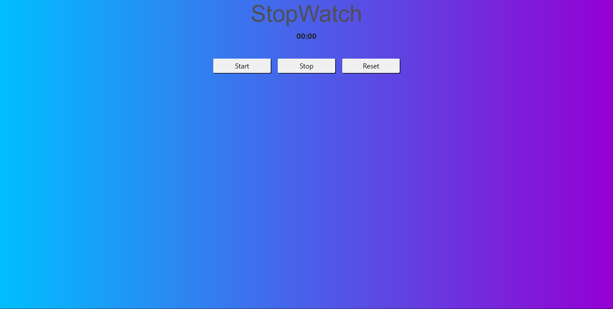

<h1 align="center"> StopWatch </h1>

StopWatch é um app público de cronometro disponível para todos.

 

  

## 🚀 Tecnologias

Esse projeto foi desenvolvido com as seguintes tecnologias:

- HTML e CSS
- JavaScript
- Git e Github

## 💻 Projeto

O StopWatch é um app para ajudar a sempre ficar no controle do seu tempo.

- [Visite o projeto online] (https://patrickpicon.github.io/nlw-setup/)
